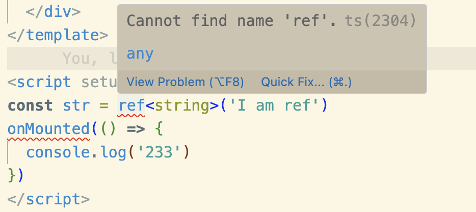

# 自动按需加载 api & 组件 & 样式

在之前的项目中，为了避免项目打包体积过大，不是全局都使用的组件都需要按需引入，使用的图标也需要手动按需引入，不断的手写 import 引入，实话实说，这非常的麻烦！

- 你是否厌烦了每次使用 vue 时，需要额外的 import vue 的 api
- 你是否厌烦了每次使用 组件库 时，需要额外的 按需引入 组件
- 你是否厌烦了有时使用 第三方组件库 时，需要额外的 引入 css 样式
- 你是否厌烦了每次使用 图标 时，需要额外的 import

现在有几个插件可以帮我们一次性解决这些问题，我们在调用时可以不需要import而直接使用，且最终打包时，只有实际使用过的api和组件才会被build进最终产物。

- unplugin-auto-import：自动按需引入 vue\vue-router\pinia 等的 api
- unplugin-vue-components：自动按需引入 第三方的组件库组件 和 我们自定义的组件
- unplugin-icons：可以自动按需引入 所使用的图标，而不用手动 import
- vite-plugin-style-import：自动按需引入 我们手动引入的组件的css样式

我这里的配置的示例代码，以 Element Plus 和 Ant Design Vue 以及 Vite 为例，Webpack 的配置可以查看官方仓库里的配置

### 3.2.1 自动按需引入api、组件、样式

安装依赖：

```shell
pnpm add -D unplugin-vue-components unplugin-auto-import
```

然后我们配置 vite.config.ts 加入以下内容：

```js
import AutoImport from 'unplugin-auto-import/vite'
import Components from 'unplugin-vue-components/vite'
import { ElementPlusResolver } from 'unplugin-vue-components/resolvers'
import { AntDesignVueResolver } from 'unplugin-vue-components/resolvers'

export default {
  plugins: [
    // ...
    AutoImport({
      dts: 'src/types/auto-import.d.ts',
      // 这里除了引入 vue 以外还可以引入pinia、vue-router、vueuse等，
      // 甚至你还可以使用自定义的配置规则，见 https://github.com/antfu/unplugin-auto-import#configuration
      imports: ['vue'],
      // 第三方组件库的解析器
      resolvers: [ElementPlusResolver()]
    }),
    Components({
      dts: 'src/types/components.d.ts',
      // dirs 指定组件所在位置，默认为 src/components
      // 可以让我们使用自己定义组件的时候免去 import 的麻烦
      dirs: ['src/components/'],
      // 配置需要将哪些后缀类型的文件进行自动按需引入
      extensions: ['vue', 'md'],
      // 解析的 UI 组件库，这里以 Element Plus 和 Ant Design Vue 为例
      resolvers: [ElementPlusResolver(), AntDesignVueResolver()]
    })
  ]
}
```

以下是AutoImport常用配置项：

```js
AutoImport({
  // 声明文件生成位置和文件名称
  // 路径自己指定，比如 'type/auto-import.d.ts'等
  // 配置此项后就会在相应路径下自动生成 auto-import.d.ts 类型文件
  dts: 'src/types/auto-import.d.ts'
  // 目标文件
  include: [
    /\.[tj]sx?$/, // .ts, .tsx, .js, .jsx
    /\.vue$/, /\.vue\?vue/, // .vue
    /\.md$/, // .md
  ],
  // 全局引入插件
  imports: [
    // presets
    'vue',
    'vue-router',
    // custom
    {
      '@vueuse/core': [
        // named imports
        'useMouse', // import { useMouse } from '@vueuse/core',
        // alias
        ['useFetch', 'useMyFetch'], // import { useFetch as useMyFetch } from '@vueuse/core',
      ],
      'axios': [
        // default imports
        ['default', 'axios'], // import { default as axios } from 'axios',
      ],
      '[package-name]': [
        '[import-names]',
        // alias
        ['[from]', '[alias]'],
      ],
    },
  ],

  // eslint报错解决
  eslintrc: {
    enabled: false, // Default `false`
    filepath: './.eslintrc-auto-import.json', // Default `./.eslintrc-auto-import.json`
    globalsPropValue: true, // Default `true`, (true | false | 'readonly' | 'readable' | 'writable' | 'writeable')
  },

  // 解析器，例如element-plus的ElementPlusResolver
  // see https://github.com/antfu/unplugin-auto-import/pull/23/
  resolvers: [
    /* ... */
  ],
})
```

这样配置完之后，它就会去自动按需引入我们在代码中使用到的组件和对应的样式，是不是很便利呢。

```js
<script setup lang="ts">
const str = ref<string>('I am ref')
onMounted(() => {
  console.log('233')
})
</script>
```

不过虽然可以正常使用了，但是此时ts会报错，如：

需要我们在 `tsconfig.json` 文件中添加一项配置：

```json
"include": [
  "src/**/*.js",
  "src/**/*.ts",
  "src/**/*.tsx",
  "src/**/*.jsx",
  "src/**/*.vue",
  "src/types/auto-imports.d.ts" // 路径和 AutoImport dts项路径保持一致 引入即可
],
```

现在，ts报错就消失了。

解决 Eslint 报错，除了在 `vite.config.ts` 中配置外，还需要在 `.eslintrc.cjs` 中添加一项配置：

```js
extends: [
  'plugin:vue/vue3-essential',
  'eslint:recommended',
  '@vue/typescript/recommended',
  '@vue/prettier',
  '@vue/prettier/@typescript-eslint',
   // 这里配置生成的JSON文件 需要和vite.config.ts文中的配置保持一致
  './.eslintrc-auto-import.json'
],
```
